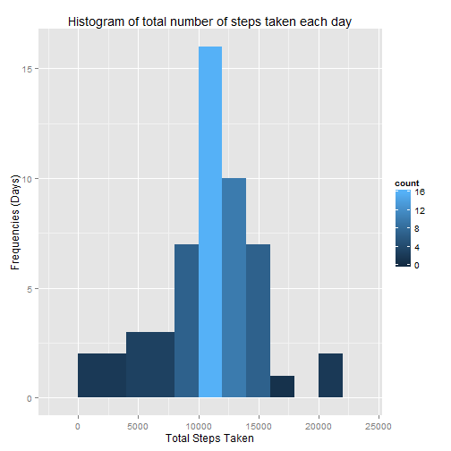
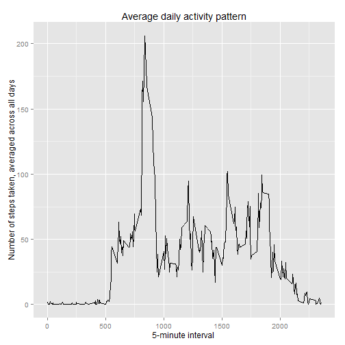
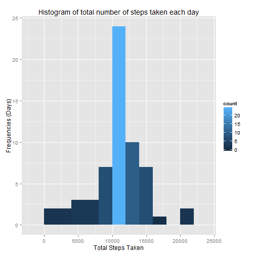

## Loading and preprocessing the data

We create a temporary data dir to unzip the data file if it wasn't unzipped already.
The data is loaded into the activity data frame.


```r
#create data dir if doesn't exist yet
if (!file.exists("data")) {
  dir.create("data")
}

#unzip the data file if doesn't exist yet
if (!file.exists("./data/activity.csv")) {
  unzip("./activity.zip", files="activity.csv", exdir="data", overwrite=TRUE)
}

# read the CSV file
activity <- read.csv("./data/activity.csv")
```
We do not do any data preprocessing at this stage.

## What is mean total number of steps taken per day?

We calculate the total number of steps taken each day while ommitting the missing values. The result is saved in the data frame activity_per_day.


```r
activity_per_day <- activity %>%
                      filter(! is.na(steps)) %>%
                      group_by(date) %>%
                      summarise( total_steps = sum(steps, na.rm = TRUE))
```

We create the histogram of the total number of steps taken each day. The bin width is 2000 steps.


```r
g <- ggplot(activity_per_day, aes(x=total_steps)) +
      geom_histogram(binwidth=2000, aes(fill = ..count..)) +
      labs(x="Total Steps Taken", y="Frequencies (Days)", title="Histogram of total number of steps taken each day")
print(g)
```

 

Median and Mean of the total number of steps taken per day.


```r
mean(activity_per_day$total_steps)
```

```
## [1] 10766.19
```

```r
median(activity_per_day$total_steps)
```

```
## [1] 10765
```


## What is the average daily activity pattern?

We calculate the daily activity pattern by grouping the data by interval and taking the average number of steps per interval. We ommit the missing data for this calculation.


```r
daily_activity_pattern <- activity %>%
                            filter(! is.na(steps)) %>%
                            group_by(interval) %>%
                            summarise( mean_steps = mean(steps, na.rm = TRUE))
```

We create a time series plot of the 5-minute interval (x-axis) and the average number of steps taken, averaged across all days (y-axis)


```r
g <- ggplot(daily_activity_pattern, aes(x = interval, y = mean_steps)) + 
  geom_line() + 
  labs(x="5-minute interval ", y="Number of steps taken, averaged across all days", title="Average daily activity pattern")
print(g)
```

 

The 5-minute interval, on average across all the days in the dataset, containing the maximum number of steps is the interval 835 with 206 steps.


```r
daily_activity_pattern[which.max(daily_activity_pattern$mean_steps), ]
```

```
## Source: local data frame [1 x 2]
## 
##   interval mean_steps
## 1      835   206.1698
```


## Imputing missing values

There are 2304 intervals with missign steps data.


```r
sum(is.na(activity))
```

```
## [1] 2304
```

We create a new dataset with the missing value filled. Each missing value is replaced by the average of the activity for the same 5-minute interval in other days.


```r
# data frame of average steps per 5-minute interval
mean_steps_per_interval <- activity %>%
                            filter(! is.na(steps)) %>%
                            group_by(interval) %>%
                            summarise( mean_steps = mean(steps, na.rm = TRUE))

activity_no_missing <- activity

# fill the missing value with the average activity for the same 5-minute interval
for (i in which(is.na(activity)))
    {
    activity_no_missing[i,1] <- mean_steps_per_interval[mean_steps_per_interval$interval==activity_no_missing[i,3],]$mean_steps
    }
```

We calculate the total number of steps taken each day with the dataset containing the filled missed values. The result is saved in the data frame activity_per_day_no_missing.


```r
activity_per_day_no_missing <- activity_no_missing %>%
                                filter(! is.na(steps)) %>%
                                group_by(date) %>%
                                summarise( total_steps = sum(steps, na.rm = TRUE))
```

We create the histogram of the total number of steps taken each day. The bin width is 2000 steps.


```r
g <- ggplot(activity_per_day_no_missing, aes(x=total_steps)) +
      geom_histogram(binwidth=2000, aes(fill = ..count..)) +
      labs(x="Total Steps Taken", y="Frequencies (Days)", title="Histogram of total number of steps taken each day")
print(g)
```

 

Median and Mean of the total number of steps taken per day for the dataset with missing values filled.


```r
mean(activity_per_day_no_missing$total_steps)
```

```
## [1] 10766.19
```

```r
median(activity_per_day_no_missing$total_steps)
```

```
## [1] 10766.19
```

The mean is the same as in the original dataset, the median is little greater and now equal to the mean.

## Are there differences in activity patterns between weekdays and weekends?
