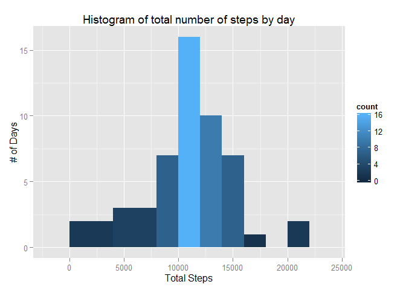

# Reproducible Research: Peer Assessment 1


```
## 
## Attaching package: 'dplyr'
## 
## The following object is masked from 'package:stats':
## 
##     filter
## 
## The following objects are masked from 'package:base':
## 
##     intersect, setdiff, setequal, union
```

## Loading and preprocessing the data

We create a temporary data dir to unzip the data file if it wasn't unzipped already.
The data is loaded into the activity data frame.


```r
#create data dir if doesn't exist yet
if (!file.exists("data")) {
  dir.create("data")
}

#unzip the data file if doesn't exist yet
if (!file.exists("./data/activity.csv")) {
  unzip("./activity.zip", files="activity.csv", exdir="data", overwrite=TRUE)
}

# read the CSV file
activity <- read.csv("./data/activity.csv")
```
We do not do any data preprocessing at this stage.

## What is mean total number of steps taken per day?


```r
activity_per_day <- activity %>%
  filter(! is.na(steps)) %>%
  group_by(date) %>%
  summarise( total_steps = sum(steps, na.rm = TRUE))

g <- ggplot(activity_per_day, aes(x=total_steps)) +
      geom_histogram(binwidth=1000, aes(fill = ..count..)) +
      labs(x="Steps", y="# of Days", title="Histogram of total number of steps by day")
print(g)
```

 

```r
# calculate the mean and median total steps per day
mean(activity_per_day$total_steps)
```

```
## [1] 10766.19
```

```r
median(activity_per_day$total_steps)
```

```
## [1] 10765
```


## What is the average daily activity pattern?


## Imputing missing values


## Are there differences in activity patterns between weekdays and weekends?
